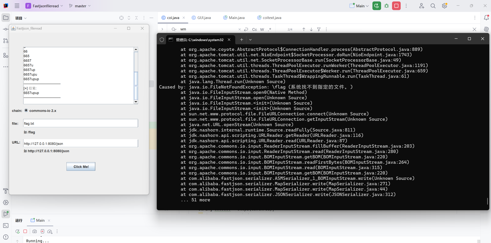

# fastjson利用工具

 

## 写在前面

 

前段时间有幸做了一道fastjson的题目，顺带研究了一下fastjson的利用链。但是苦于网络上有关fastjson的利用脚本很少，所以就萌生了利用空闲时间写一个fastjson的gui版利用脚本。不仅巩固一下我的java学习，也为其他人比赛和研究提供一些方便

 

##关于漏洞 CVE-2022-25845-In-Spring

 

参考如下：

[luelueking/CVE-2022-25845-In-Spring](https://github.com/luelueking/CVE-2022-25845-In-Spring)

[fastjson1.2.80 in Springtboot新链学习记录](https://xz.aliyun.com/t/16708)

[ph0ebus/CVE-2022-25845-In-Spring](https://github.com/ph0ebus/CVE-2022-25845-In-Spring)

 

还在慢慢慢慢地磨蹭，如果你看到这里作者还没做好第二条链子，请速度去拷打作者。
